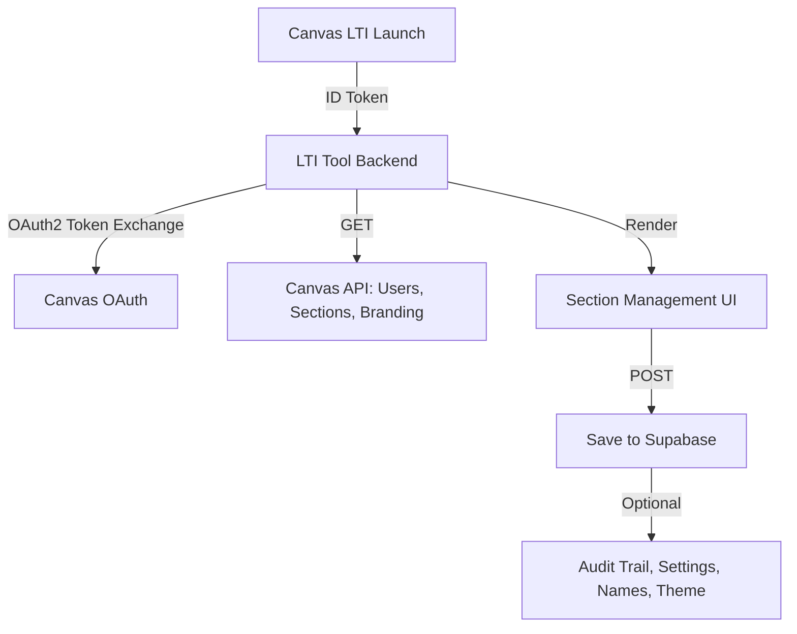

**Technical Requirements Document (TRD)**

**Project:** Canvas Section Management Tool
**Author:** \[Anwar / AI Automation Engineer]
**Target Environment:** Canvas LMS (via LTI 1.3)
**Deployment Target:** Vercel (Frontend), Supabase (Database), optional Express.js backend (Render or Vercel API routes)
**Version:** 1.0
**Last Updated:** [Current Date]

---

## 1. **Purpose**

To define the technical architecture, components, data flow, and integration approach for the Canvas Section Management Tool. This tool will enable educators to dynamically create, edit, and manage sections within Canvas LMS via a user-friendly LTI interface.

---

## 2. **System Overview**

The tool is a web-based LTI 1.3-compliant application that:

* Authenticates via Canvas LTI launch
* Communicates with Canvas APIs to manage sections/enrollments
* Allows educators to assign students automatically or manually
* Applies section ratio logic, census locking, visibility rules
* Is deployable and scalable via serverless/web app infrastructure

---

## 3. **Architecture**

### Frontend (Vercel + Next.js)

* Built with React (Next.js)
* Tailwind CSS for UI styling
* Pages: LTI Launch, Section Dashboard, Manual Assignment UI, Settings
* Embedded inside Canvas via iframe

### Backend (API Routes or Node/Express)

* Handles:

  * LTI 1.3 launch validation
  * Canvas OAuth2 token exchange
  * Canvas API calls (users, enrollments, sections)
  * Section naming logic & warnings
  * Audit logging
  * Canvas branding detection and injection

### Database (Supabase / PostgreSQL)

* Stores:

  * Census date configuration
  * Internal vs display names
  * Section visibility flags
  * Audit trail of changes
  * Keyword warning list
  * Cached branding themes per institution

---

## 4. **LTI Integration (LTI 1.3)**

* Uses `ltijs` (Node.js) or `ims-lti` (Python/Java)
* LTI Deep Linking not required (unless we expand to custom tool placement)
* Canvas roles interpreted to determine access (educator/admin only)
* JWT/ID Token from Canvas used for secure launch
* Canvas Developer Key required to register tool (for each instance)

---

## 5. **Canvas API Endpoints Used**

| API         | Endpoint                           | Use                                   | Rate Limit |
| ----------- | ---------------------------------- | ------------------------------------- | ---------- |
| Users       | `/api/v1/courses/:id/users`        | Fetch all enrolled students           | 100/min    |
| Sections    | `/api/v1/courses/:id/sections`     | Create/update sections                | 100/min    |
| Enrollments | `/api/v1/sections/:id/enrollments` | Move/add students to sections         | 100/min    |
| Courses     | `/api/v1/courses/:id`              | Course metadata, census date override | 100/min    |
| Branding    | `/api/v1/accounts/self/branding`   | Fetch primary color, logo, theme      | 100/min    |

---

## 6. **Data Flow**



---

## 7. **Security**

* OAuth2-based authentication with Canvas token scoping
* HTTPS endpoints via Vercel / Render
* Supabase row-level security (RLS) where needed
* All LTI launches validated using state + nonce
* Sensitive keywords stored server-side and checked on save
* Canvas branding data stored per domain and securely retrieved

### Security Measures

#### Authentication
* LTI 1.3 JWT validation
* OAuth2 token management
* Session handling
* Role-based access control

#### Data Protection
* HTTPS encryption
* Data encryption at rest
* Secure cookie handling
* XSS protection
* CSRF protection

#### Access Control
* Role-based permissions
* IP whitelisting (optional)
* Rate limiting
* Audit logging

---

## 8. **Hosting Plan (MVP)**

| Component | Host                                 | Notes                                          |
| --------- | ------------------------------------ | ---------------------------------------------- |
| Frontend  | Vercel                               | Next.js deployment with serverless support     |
| Backend   | Vercel (API routes) or Render (Node) | Handles Canvas API calls and LTI launches      |
| DB        | Supabase (Free Tier)                 | Postgres storage for configs + logs + branding |

### Infrastructure Requirements

#### Frontend
* Node.js 18+
* Next.js 13+
* React 18+
* Tailwind CSS 3+

#### Backend
* Node.js 18+
* Express.js 4+
* LTI 1.3 library
* Canvas API client

#### Database
* PostgreSQL 14+
* Supabase
* Row-level security
* Automated backups

---

## 9. **DevOps & Deployment**

* GitHub repo connected to Vercel for automatic deployments
* `.env` config for LTI credentials, Canvas API keys, Supabase URL
* Dev/staging/prod environments managed via Vercel projects
* LTI registration for each Canvas instance (via developer key)

### CI/CD Pipeline

#### Development
* Local development environment
* Hot reloading
* ESLint + Prettier
* TypeScript checking

#### Testing
* Jest for unit tests
* Cypress for E2E tests
* GitHub Actions for CI
* Automated testing on PR

#### Deployment
* Vercel preview deployments
* Staging environment
* Production deployment
* Rollback capability

---

## 10. **Testing Strategy**

* LTI launch tested using Canvas test environment (test.instructure.com)
* Unit tests for Canvas API integrations (mocked)
* Manual E2E tests for full section flow
* Post-MVP: Cypress for UI regression, JMeter or k6 for performance

### Test Coverage

#### Unit Tests
* API endpoints
* Business logic
* Data validation
* Error handling

#### Integration Tests
* LTI launch flow
* Canvas API integration
* Database operations
* Authentication flow

#### E2E Tests
* User workflows
* Section management
* Student allocation
* Census date handling

#### Performance Tests
* Load testing
* Stress testing
* API response times
* Concurrent users

---

## 11. **Canvas Branding Sync Implementation**

* On LTI launch, extract `custom_canvas_api_domain` and issue `GET /api/v1/accounts/self/branding`
* Extract `primary_color`, `font_family`, and `logo_image`
* Store these values in Supabase linked to domain ID
* Inject values into frontend via:

  * CSS variables (`--brand-primary`, etc.)
  * Tailwind config with dynamic theme injection
* Fallback: Admin panel lets Canvas admins manually define primary color + logo for theming
* Apply branding styles via runtime CSS injection:

```js
document.documentElement.style.setProperty('--brand-primary', branding.primaryColor);
```

* Tailwind example config:

```js
// tailwind.config.js
extend: {
  colors: {
    brand: 'var(--brand-primary)',
  }
}
```

---

## 12. **Database Schema**

### Tables

#### sections
```sql
CREATE TABLE sections (
  id UUID PRIMARY KEY,
  course_id TEXT NOT NULL,
  name TEXT NOT NULL,
  display_name TEXT,
  capacity INTEGER,
  is_visible BOOLEAN DEFAULT true,
  created_at TIMESTAMP WITH TIME ZONE DEFAULT NOW(),
  updated_at TIMESTAMP WITH TIME ZONE DEFAULT NOW()
);
```

#### enrollments
```sql
CREATE TABLE enrollments (
  id UUID PRIMARY KEY,
  section_id UUID REFERENCES sections(id),
  user_id TEXT NOT NULL,
  role TEXT NOT NULL,
  created_at TIMESTAMP WITH TIME ZONE DEFAULT NOW(),
  updated_at TIMESTAMP WITH TIME ZONE DEFAULT NOW()
);
```

#### settings
```sql
CREATE TABLE settings (
  id UUID PRIMARY KEY,
  course_id TEXT NOT NULL,
  census_date TIMESTAMP WITH TIME ZONE,
  target_ratio INTEGER DEFAULT 25,
  created_at TIMESTAMP WITH TIME ZONE DEFAULT NOW(),
  updated_at TIMESTAMP WITH TIME ZONE DEFAULT NOW()
);
```

#### audit_logs
```sql
CREATE TABLE audit_logs (
  id UUID PRIMARY KEY,
  course_id TEXT NOT NULL,
  user_id TEXT NOT NULL,
  action TEXT NOT NULL,
  details JSONB,
  created_at TIMESTAMP WITH TIME ZONE DEFAULT NOW()
);
```

---

## 13. **Error Handling & Logging**

### Error Types

#### User Errors
* Invalid input
* Permission denied
* Resource not found
* Validation failed

#### System Errors
* API failures
* Database errors
* Network issues
* Authentication failures

### Logging Strategy

#### Log Levels
* ERROR: System errors
* WARN: User errors
* INFO: Important actions
* DEBUG: Development info

#### Log Storage
* Supabase logs
* Vercel logs
* Error tracking service
* Audit trail

---

## 14. **Performance Optimization**

### Frontend
* Code splitting
* Lazy loading
* Image optimization
* Caching strategy

### Backend
* API caching
* Database indexing
* Query optimization
* Rate limiting

### Database
* Index optimization
* Query planning
* Connection pooling
* Backup strategy

---

## 15. **Monitoring & Alerting**

### Metrics
* API response times
* Error rates
* User activity
* Resource usage

### Alerts
* Error thresholds
* Performance issues
* Security events
* System health

### Tools
* Vercel Analytics
* Supabase Monitoring
* Error tracking
* Performance monitoring

---

## 16. **Open Technical Questions**

* Will sections created by this tool conflict with AllocatePlus? Should they coexist or override?
* Should we allow Canvas admins to enforce naming templates globally?
* Do we need a long-term data archive/log policy?
* Should branding sync fallback be editable by educators if admin API is not accessible?

---

## 17. **Post-MVP Enhancements (Stretch Goals)**

* Real-time notifications to students when moved
* Export/import of section settings/templates
* Educator analytics: average section size, load heatmaps
* Accessibility validation via automated tools (axe-core)

---

## 18. **Next Steps**

* [ ] Set up Canvas Developer Key for LTI
* [ ] Scaffold Next.js + ltijs boilerplate
* [ ] Configure Supabase DB schema
* [ ] Build UI mockups for section dashboard + assignment flow
* [ ] Implement branding sync from Canvas domain
* [ ] Begin Sprint 1 (API access + launch handler)

---

## 19. **Appendix: API Response Formats**

### Success Response
```json
{
  "status": "success",
  "data": {
    // Response data
  },
  "message": "Operation successful"
}
```

### Error Response
```json
{
  "status": "error",
  "error": {
    "code": "ERROR_CODE",
    "message": "Error description",
    "details": {
      // Additional error details
    }
  }
}
```

---

This document will be updated as the project evolves and new requirements are identified.
